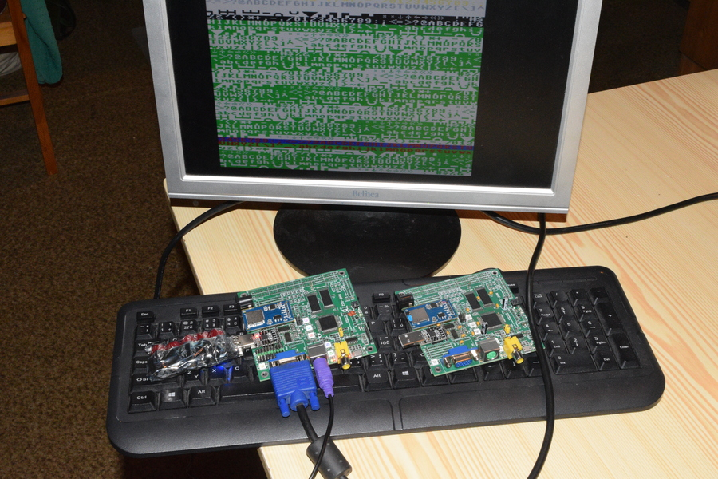
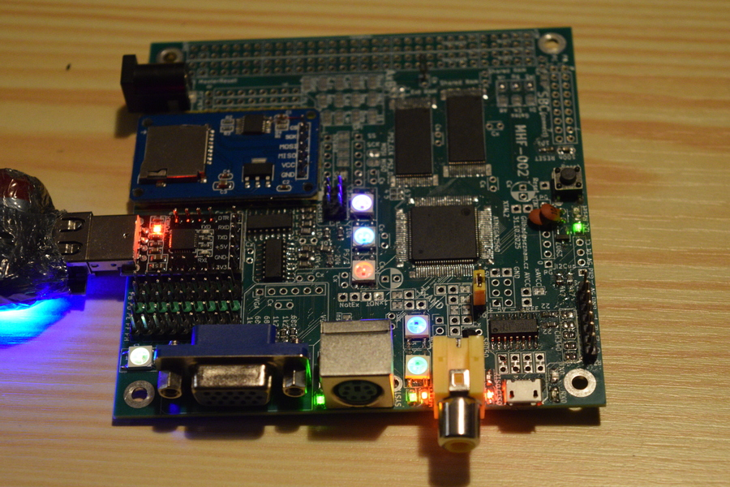
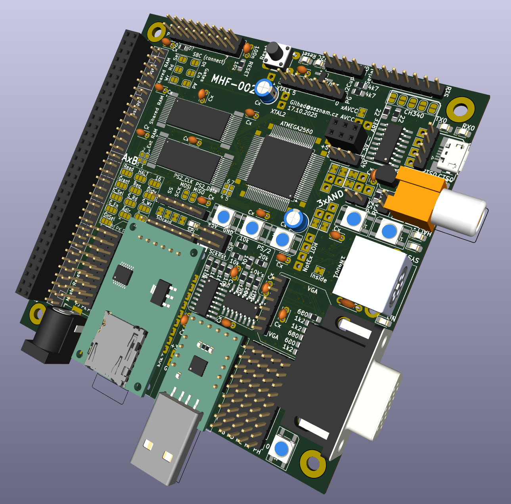
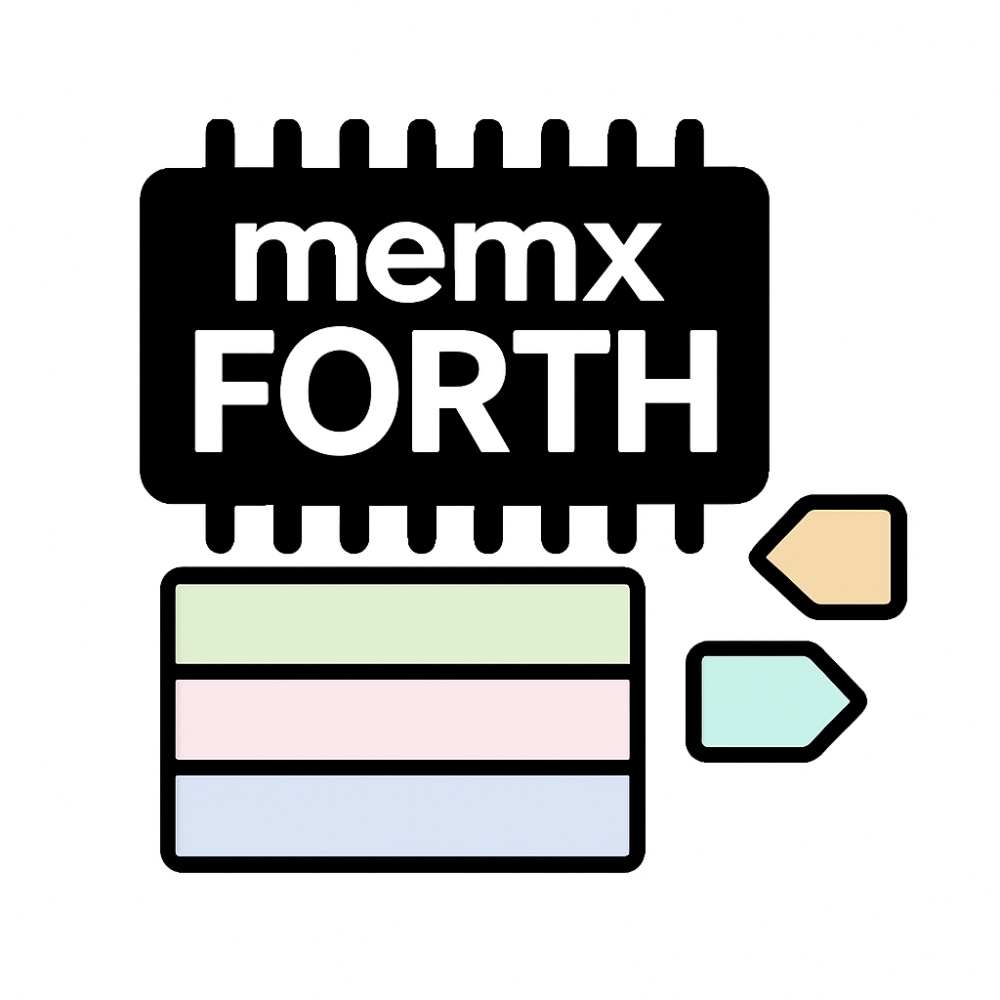
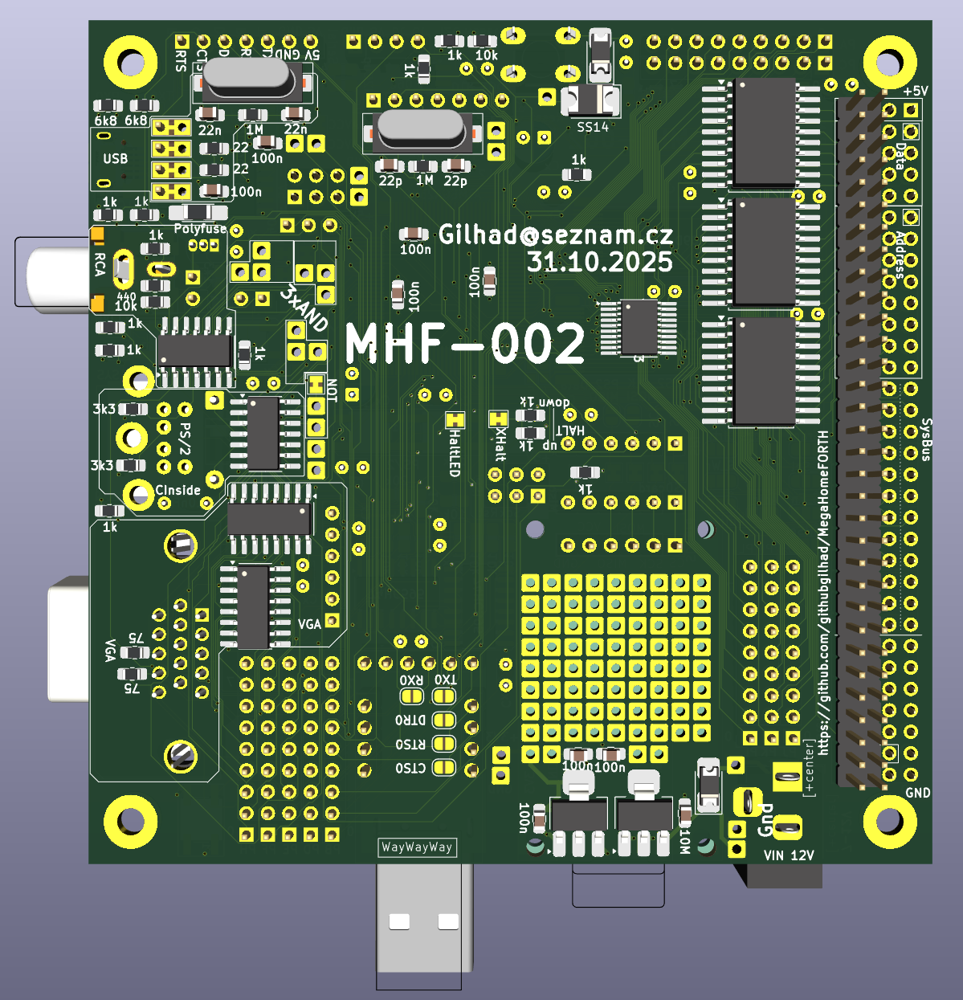
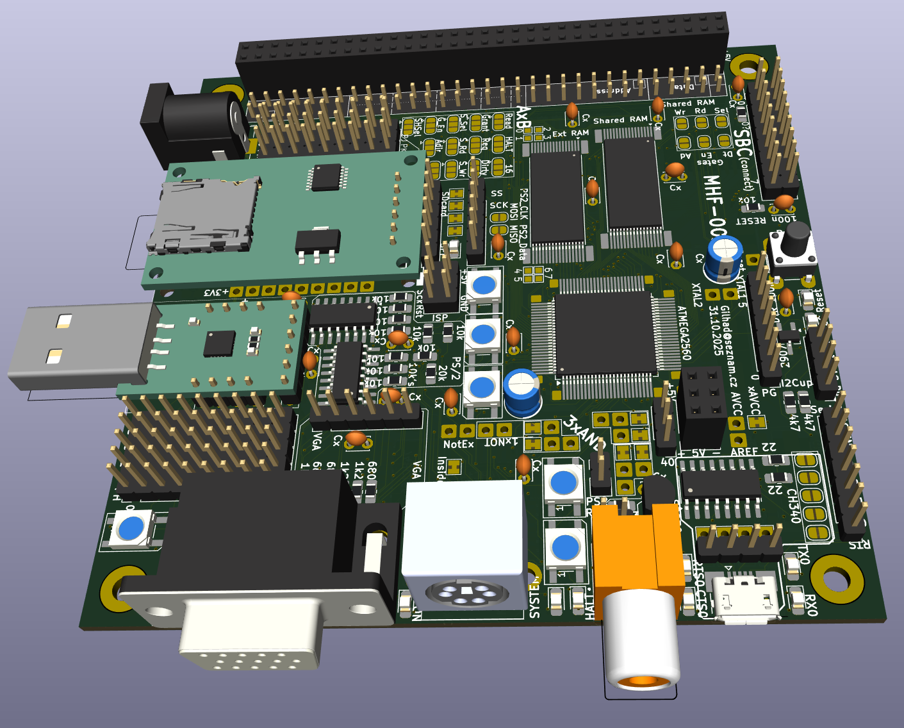
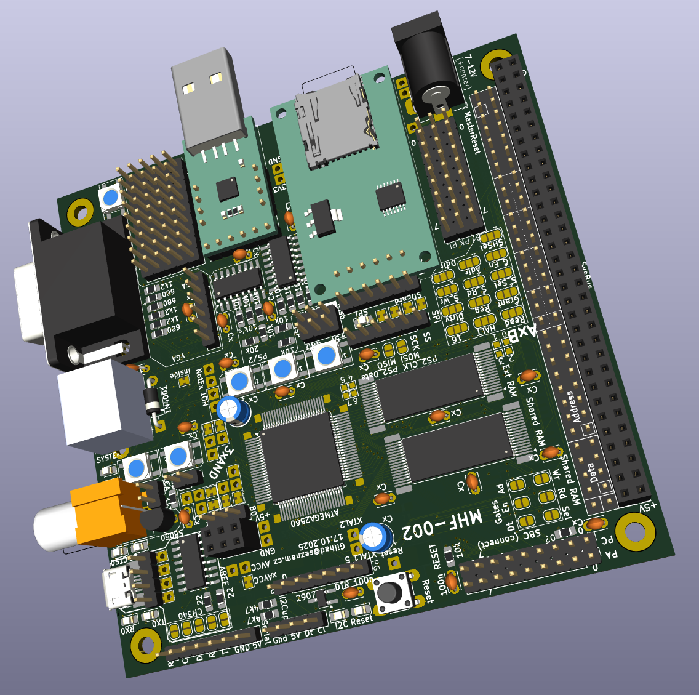
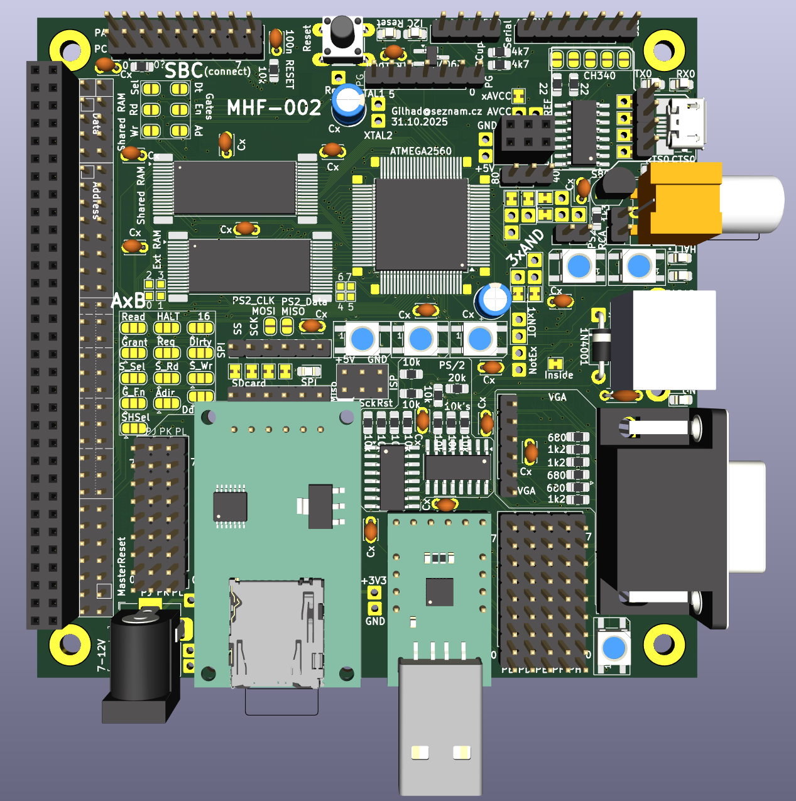

..  vim: ft=rst noexpandtab fileencoding=utf-8 nomodified wrap foldmethod=marker foldmarker={{{,}}} foldcolumn=4 ruler showcmd lcs=tab\:|- list tabstop=8 nosmarttab textwidth=270 linebreak showbreak=--»\ 

.. |Ohm| raw:: html

	Ω

.. |kOhm| raw:: html

	kΩ

|MemxFORTHChipandColorfulStack.png|

MegaHomeFORTH MHF-002
=====================

This is next iteration of `MegaHomeFORTH MHF-001 <https://github.com/githubgilhad/MegaHomeFORTH/tree/MHF-001>`__

MHF-001 was sponsored by PCBway.com, which generously manufactured the PCB for it as sponsorship. The PCB was perfectly done and allowed for testings and rewiring problematic parts to reveal hidden problems in the first iteration design.

MHF-002 have more than 75 improvements over MHF-001 and should be even more testable and more convenient for hand soldering, while using more modern parts.

Global Goals
============

|MHF-002.png|

|MHF-002.a.s.jpg|

|MHF-002.b.s.jpg|

MHF vzniknul jako realizace návrhu grafické a I/O karty pro 8-bitový počítač založený na procesoru HD6309 (dále značený CPU). Vlastní provedení je postaveno na mikrokontroleru ATmega2560 (použitém například v Arduino Mega Pro, dále ho budu označovat MCU) doplněném pamětí RAM a několika jednoduchými obvody pro vstup a výstup. Další chip RAM slouží pro přenášení dat oběma směry, střídavě ho sdílí CPU a MCU. Výhodou je velká propustnost (za cenu latence) a snadný přístup z obou systémů.

V průběhu ladění předběžných verzí se ukázalo jako velká výhoda mít interaktivní přístup k HW, proto byl implementován FORTH. Také se ukázalo, že kromě VGA/RCA se dá souběžně i číst PS/2 klávesnice a manipulovat s SD kartou, takže s dostatečnou pamětí je ta grafická karat schopna fungovat i jako samostatný jednodeskový počítač (SBC - Single Board Computer), což je pro ladění výhodnější režim.

Protože pro přístup ke sdílené RAM je nutná spolupráce GLUE, obsahuje deska i jumpery pro snadné nastavení SBC režimu, kde některé signály určené pro SysBus jsou přesměrovány přímo na sdílenou paměť.

Podrobná konfigurace a možnosti použití boudou rozepsány na samostatné stránce, pro rychlý start stačí v režimu grafické karty propájet buď levou, nebo pravou stranu jumperů A/B, zatímco pro režim SBC stačí propájet jumpery SBC - tyto volby se navzájem vylučují (buď grafická karta, nebo SBC).

Dále následují náhledy na MHF-002 a odkazy na schéma a PCB (jen horní a dolní vrstva, obě prostřední jsou vyhrazeny pro napájení), které byly vygenerovány ze souborů pro KiCad.

|view_top.png|

|view.bottom.png|

|view_1.png|

|view_2.png|

`Schema <schema.pdf>`__

`PCB <pcb.pdf>`__
