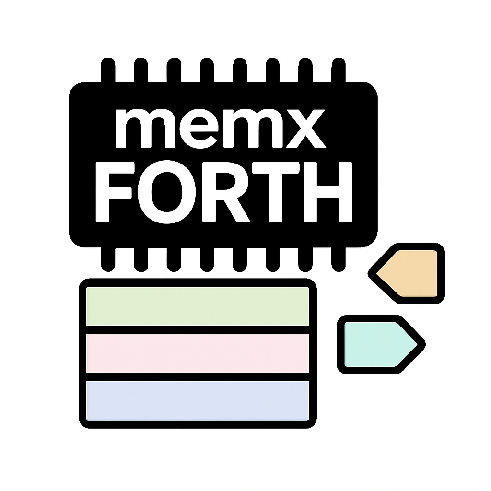

.. vim: set ft=rst noexpandtab fileencoding=utf-8 nomodified   wrap textwidth=0 foldmethod=marker foldmarker={{{,}}} foldcolumn=4 ruler showcmd lcs=tab\:|- list tabstop=8 noexpandtab nosmarttab softtabstop=0 shiftwidth=0 linebreak showbreak=»\

.. |Ohm| raw:: html

	Ω

.. |kOhm| raw:: html

	kΩ

MegaHomeFORTH
=============

Mega Home Computer with FORTH on ATmega2560 - step to graphic card for HD6309 - VGA, RCA, PS/2 - see `Larger Picture`_

This project is more about the HW part of solution (but with enought SW to be fully tested and expanded (will be build on the way)).

Index
-----

- `MegaHomeFORTH`_
	- `Project Goals`_
	- `Larger Picture`_
	- `Progress`_ 

Project Goals
==============

Depending on how much components will be soldered to the PCB, it could offer many things (at cost of using some pins):

- full breakout of ATmega2560 - like Arduino Mega, but ***all** pins accessible - simply, plain, 86 I/O pins
- USB serial connection - 2 pins
- memory extended to 64 kB RAM - at cost of 16+4 pins
- another 128 kB RAM (somehow) accessible - another 24+3 pins 
	- and shared over bus with HD6309/6502/other 8 bit computer - +5pins?
- VGA output (~40x25 characters text screen or 320x200 B/W graphic) - 8+3 pins
	- 4+4 bits forefround+background colors for full text lines (or single graphic lines) - 8 pins
- RCA ("composite") B/W output ( can do this OR VGA, not both at the same time, but may switch it SW way ) - 3 pins 
- PS/2 input - 2 or 8+1 pins (much smoother operation)
- SD card reader (may interfere with video interrupts?) - 4pins

In full power it can serve as SBC (Single Board Computer) - or as inteligent Video+Keyboard card for 8 bit computer.

Larger Picture
===============

This project is based on:

- `NanoHomeComputer <https://github.com/githubgilhad/NanoHomeComputer>`__ for HW part
	-  which is based on `Squeezing Water from Stone 3: Arduino Nano + 1(!) Logic IC = Computer with VGA and PS/2 <https://github.com/slu4coder/YouTube>`__ and `Composite video from Arduino UNO <https://www.youtube.com/watch?v=Th18tLP86WQ>`__ 
- `memxFORTH-core <https://github.com/githubgilhad/memxFORTH-core>`__ for using 24bit pointers on ATmega2560
- `pcFORTH-core <https://github.com/githubgilhad/pcFORTH-core.git>`__ for bigger FORTH implementation
- many different internet sources, discussions and hints

It is another step to retrocomputer based on HD6309 - see `some <http://comp24.gilhad.cz/Comp24-specification.html>`__ `pages <http://comp24.gilhad.cz/documentation/Comp24.html>`__ for basic idea.

Video part was successfully tested on NanoHomeComputer, but ATmega328P with only 2kB RAM and 32kB Flash was too limiting for larger project

|ascii.jpg|

Progress
========

Just starting - 1/9

see `Progress <doc/Progress.rst>`__

License
-------
GPL 2 or GPL 3 - choose the one that suits your needs.

Author
------
Gilhad - 2025

