.. vim: set ft=rst noexpandtab fileencoding=utf-8 nomodified   wrap textwidth=0 foldmethod=marker foldmarker={{{,}}} foldcolumn=4 ruler showcmd lcs=tab\:|- list tabstop=8 noexpandtab nosmarttab softtabstop=0 shiftwidth=0 linebreak showbreak=»\

.. |Ohm| raw:: html

	Ω

.. |kOhm| raw:: html

	kΩ

.. image:: ../../MemxFORTHChipandColorfulStack.png
	:width: 250
	:target: ../../MemxFORTHChipandColorfulStack.png

Many thanks to `PCBway <https://www.pcbway.com/>`__, which sponsored this project by manufacturing the PCB for free. The code for this PCB is **W828834AS5P3** and I will create it as free project after I populate it with all parts and get it to work somehow (= I will write SW for demonstrating at least some functionality).

MegaHomeFORTH - MHF-001
========================

Mega Home Computer with FORTH on ATmega2560 - step to graphic card for HD6309 - VGA, RCA, PS/2 - see `Larger Picture`_

This project is more about the HW part of solution (but with enought SW to be fully tested and expanded (will be build on the way)).

This is first PCB manufactured.

See `<../../HW/KiCad/MHF-001/>`_

Index
-----

- `MegaHomeFORTH`_
	- `Project Goals`_
	- `Also discovered`_
	- `Errata and Improvements`_
	- `Larger Picture`_
	- `Progress`_

Project Goals
==============

Depending on how much components will be soldered to the PCB, it could offer many things (at cost of using some pins):

- full breakout of ATmega2560 - like Arduino Mega, but **all** pins accessible - simply, plain, 86 I/O pins |DSC_8304.s.jpg| |DSC_8305.s.jpg|  `blink_all <https://github.com/githubgilhad/memxFORTH-asm/tree/master/SW/progs/demo/blink_all>`__ 
- USB serial connection - 2 pins
- memory extended to 64 kB RAM - at cost of 16+4 pins
- another 128 kB RAM (somehow) accessible - another 24+3 pins
	- and shared over bus with HD6309/6502/other 8 bit computer - +5pins?
- VGA output (~40x25 characters text screen or 320x200 B/W graphic) - 8+3 pins
	- 4+4 bits forefround+background colors for full text lines (or single graphic lines) - 8 pins
- RCA ("composite") B/W output ( can do this OR VGA, not both at the same time, but may switch it SW way ) - 3 pins
- PS/2 input - 2 or 8+1 pins (much smoother operation)
- SD card reader (may interfere with video interrupts?) - 4pins

In full power it can serve as SBC (Single Board Computer) - or as inteligent Video+Keyboard card for 8 bit computer.

Also discovered
================

* VGA timing `<../VGA/>`_
* SDA card `<../../HW/Foto/SD_card/>`_
* Arduino Mega Pro - ATmega2560 `<../../HW/KiCad/ATmega2560-MegaPro-001/>`_

Errata and Improvements
========================

* The transistor is `S8050`, not BC107
* the Inside capacitor is `10 nF`, not 100pF
* the resistor is 20 |kOhm|, no 3k3/22k
* (and maybe it does not matter)
* I destroyed the reset button when unsoldering it, so I improvised and used clasical Arduino pushbutton, bend its legs and solder it there - it works
* I left blink program inside, while soldering all gates chips, which is bad, as there are outputs too. So I hold the reset, until I ISPloaded new program.
* I also destroyed USB connector while desoldering it, so I bought some replacements, should arrive after month or so ... I may iprovise normal Serial connection or something else.
* It would be better to switch `X16` and `CTS` lines, so `CTS` could use interrupt on low. (CTS can be also ignored, or checked on regular schedule, like 50/sec in SW)
* LED on `PB7` aka `SYSTEM_LED` for bootloader may be usefull (even when it is `VGA_latch`)
* LED on `Reset` may help to debug serial communication (`DTR` pin via capacitor)
* for `ISCP` it is needed to set `hfuse` to 0xD9 (run program) instead of 0xD8 (run bootloader) as ICSP destroy bootloader (or what)
* `blink_all <https://github.com/githubgilhad/memxFORTH-asm/tree/master/SW/progs/demo/blink_all>`__  from `memxFORTH-asm <https://github.com/githubgilhad/memxFORTH-asm>`__  may be usefull
* make my own footprints with longer pads for SMD ICs to make soldering easier

Larger Picture
===============

This project is based on:

- `NanoHomeComputer <https://github.com/githubgilhad/NanoHomeComputer>`__ for HW part
	-  which is based on `Squeezing Water from Stone 3: Arduino Nano + 1(!) Logic IC = Computer with VGA and PS/2 <https://github.com/slu4coder/YouTube>`__ and `Composite video from Arduino UNO <https://www.youtube.com/watch?v=Th18tLP86WQ>`__
- `memxFORTH-core <https://github.com/githubgilhad/memxFORTH-core>`__ for using 24bit pointers on ATmega2560
- `pcFORTH-core <https://github.com/githubgilhad/pcFORTH-core.git>`__ for bigger FORTH implementation
- many different internet sources, discussions and hints

It is another step to retrocomputer based on HD6309 - see `some <http://comp24.gilhad.cz/Comp24-specification.html>`__ `pages <http://comp24.gilhad.cz/documentation/Comp24.html>`__ for basic idea.

Video part was successfully tested on `NanoHomeComputer <https://github.com/githubgilhad/NanoHomeComputer>`__, but ATmega328P with only 2kB RAM and 32kB Flash was too limiting for larger project

|ascii.jpg|

Progress
========

Soldering parts and testing.

Done:

* get Arduino Mega Pro
* get 16MHz to output
* map pins in NanoHomeComputer
* map pins on ATmega2560
* map timers in NanoHomeComputer
* assign VGA/RCA/PS2 pins to ATmega2560
* test VGA output
* test RCA output
* test PS/2 direct input
* test PS/2 8bit input
* assign rest pins on ATmega2560
* draw schema `<HW/KiCad/MHF-001/MHF-001.pdf>`_
* draw PCB
* order PCB
* get PCB manufactured `<HW/KiCad/MHF-001/output.zip>`_

Next steps:

* solder component |DSC_8304.s.jpg| |DSC_8305.s.jpg|

* test each goal
* physical tests
* programming
* enjoy :)

Something works now: |DSC_8303.s.jpg|

see `Progress <../Progress.rst>`__ and `Journal <docs/Journal.rst>`__

I have some ideas, but it would need lot of work to bring it into life

|Idea_001| |Idea_001_a| |Idea_001_b.png|

|Idea_002| |Idea_002_a| |Idea_002_b.png|

|Idea_003| |Idea_003_a| |Idea_003_b.png|

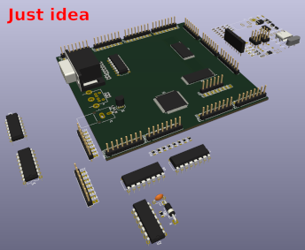

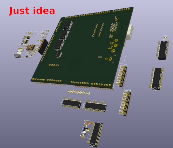

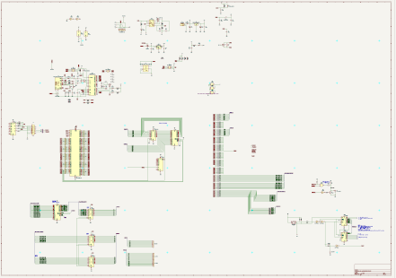

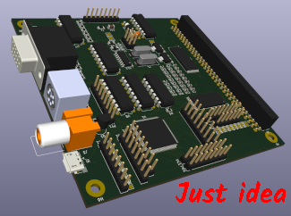

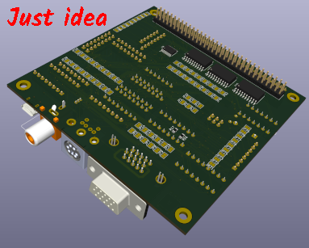

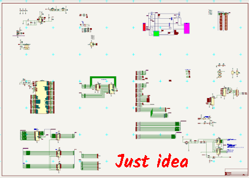

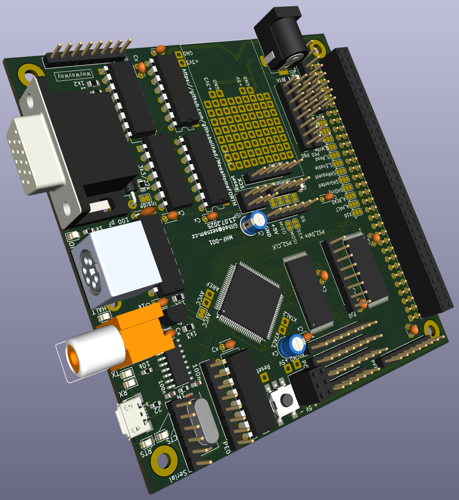

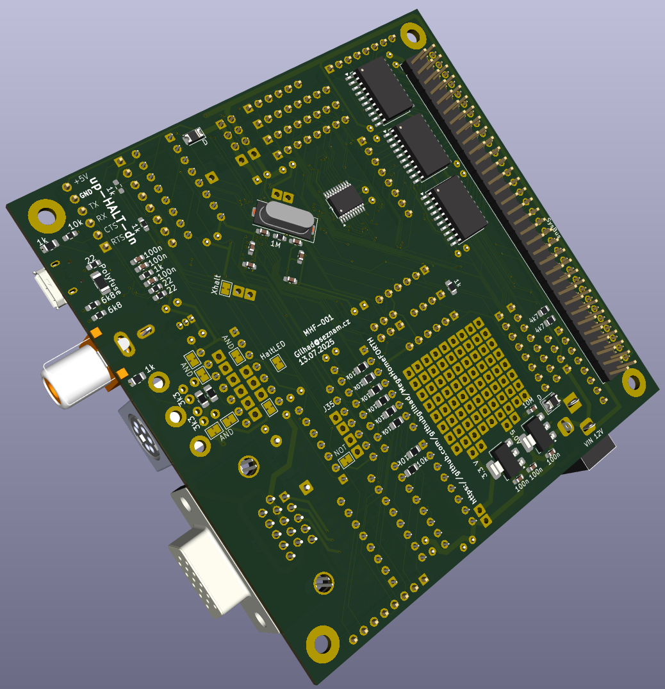

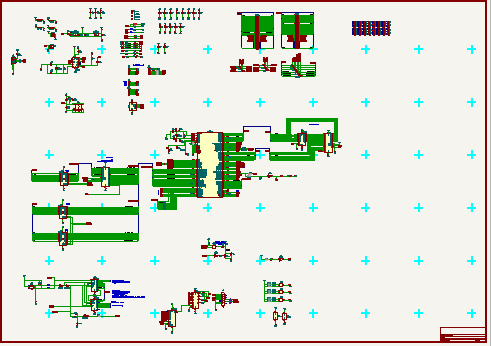

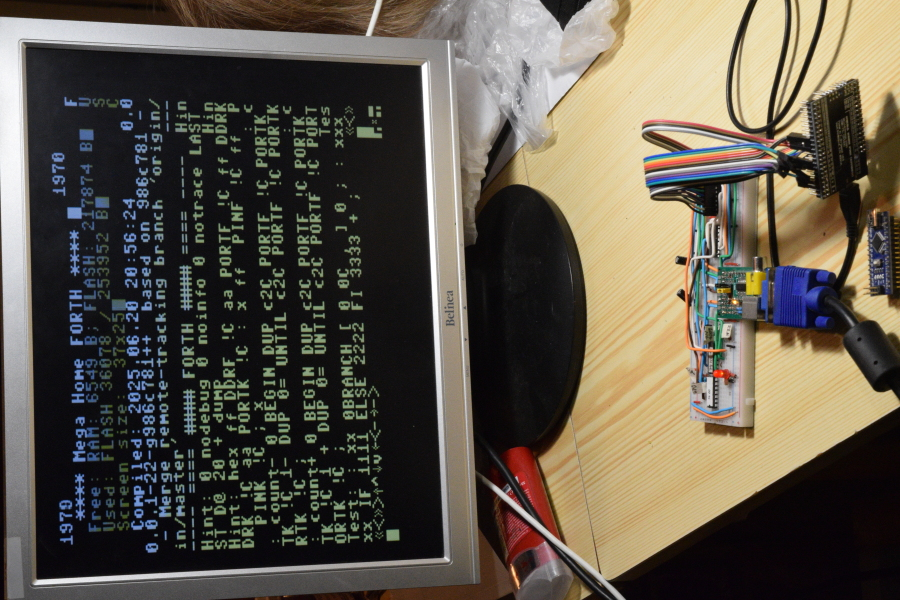

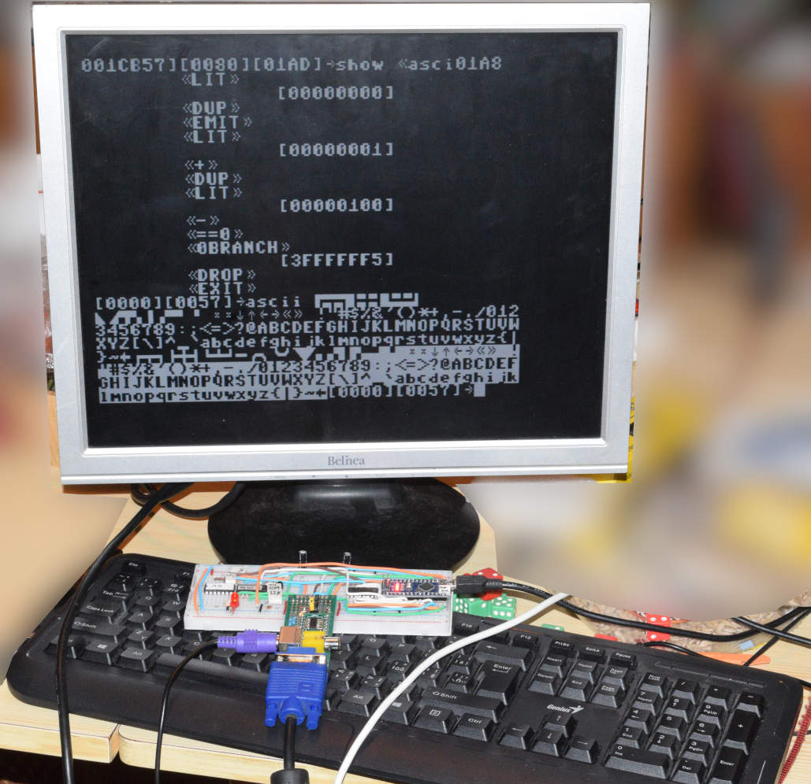

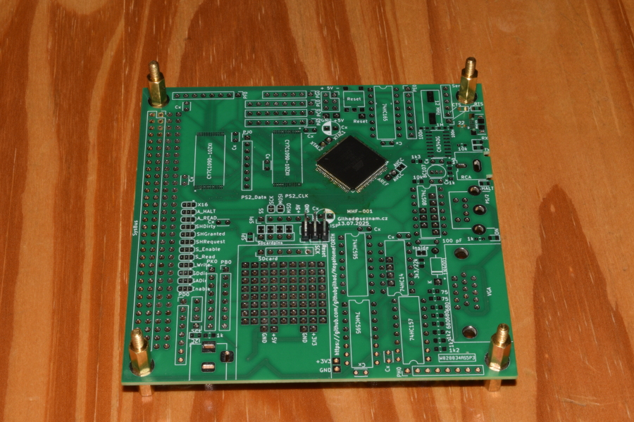

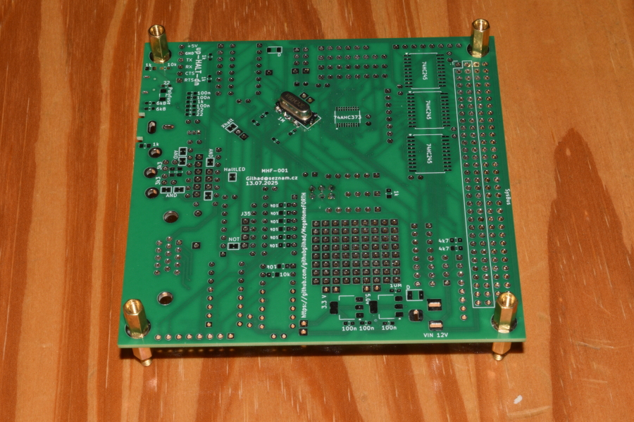

License
-------
GPL 2 or GPL 3 - choose the one that suits your needs.

Author
------
Gilhad - 2025

