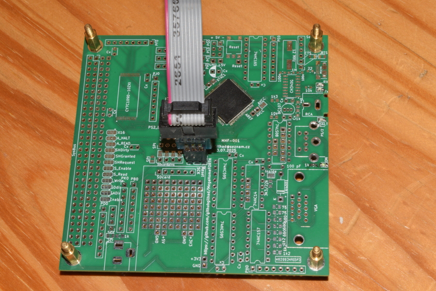
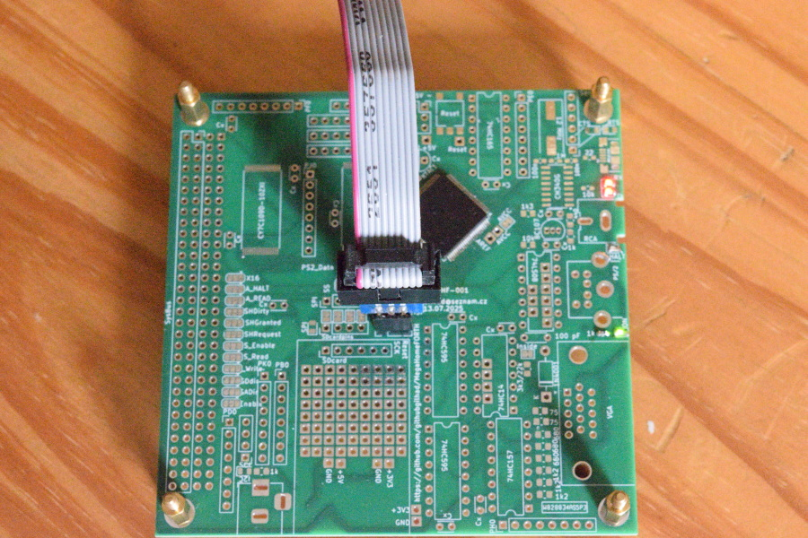
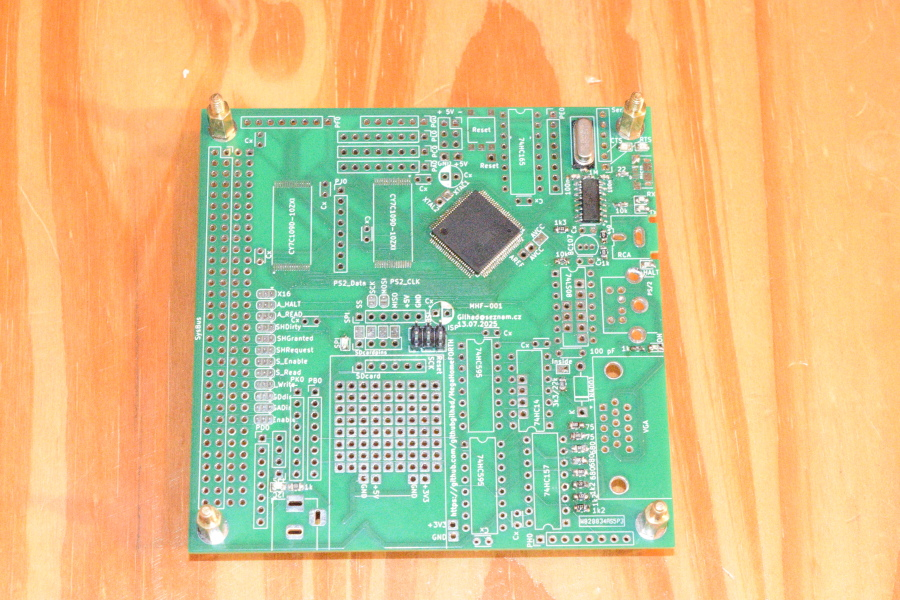
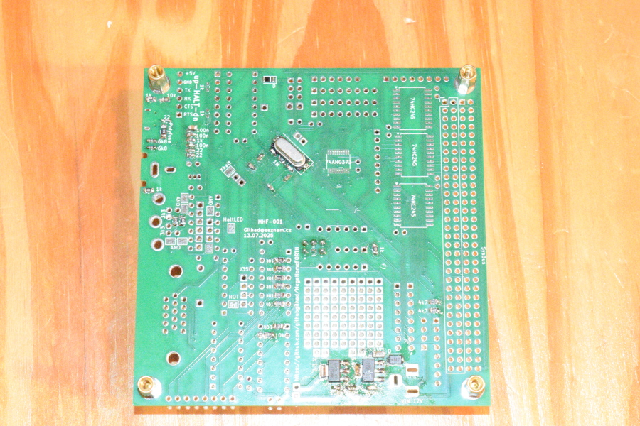
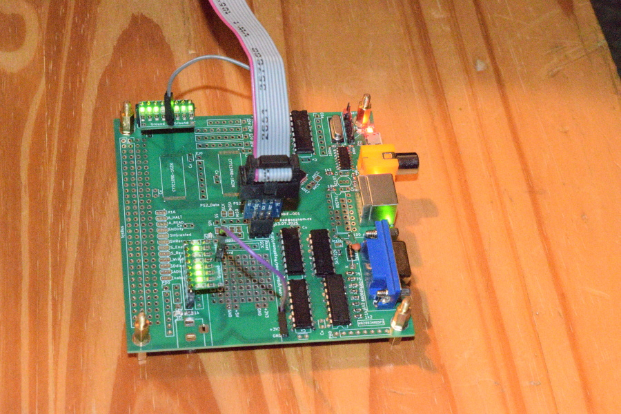
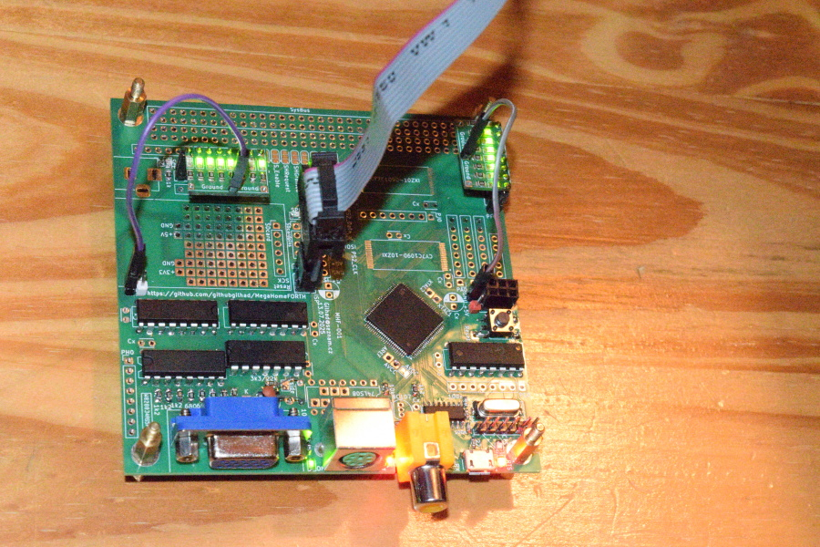
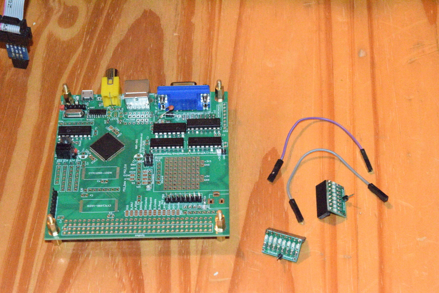
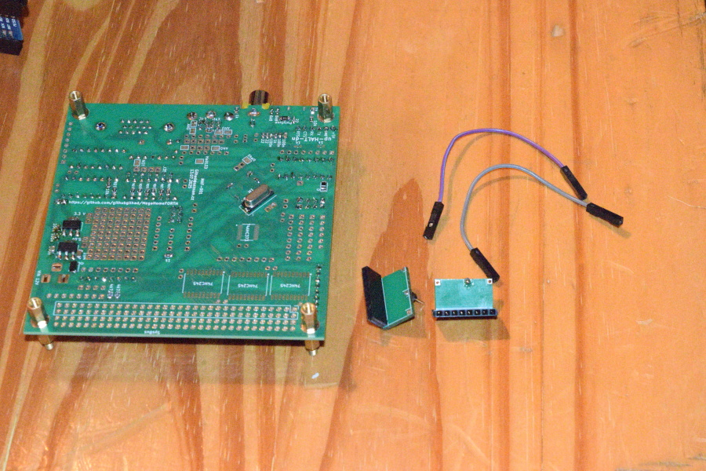
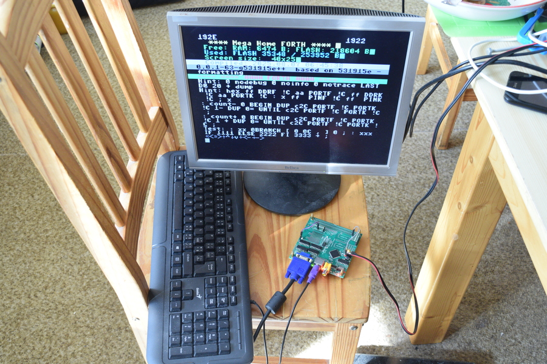

.. vim: set ft=rst noexpandtab fileencoding=utf-8 nomodified   wrap textwidth=0 foldmethod=marker foldmarker={{{,}}} foldcolumn=4 ruler showcmd lcs=tab\:|- list tabstop=8 noexpandtab nosmarttab softtabstop=0 shiftwidth=0 linebreak showbreak=»\

.. |Ohm| raw:: html

	Ω

.. |kOhm| raw:: html

	kΩ

.. image:: ../../MemxFORTHChipandColorfulStack.png
	:width: 250
	:target: ../../MemxFORTHChipandColorfulStack.png

Many thanks to `PCBway <https://www.pcbway.com/>`__, which sponsored this project by manufacturing the PCB for free. The code for this PCB is **W828834AS5P3** and I will create it as free project after I populate it with all parts and get it to work somehow (= I will write SW for demonstrating at least some functionality).

MegaHomeFORTH - MHF-001
========================

Mega Home Computer with FORTH on ATmega2560 - step to graphic card for HD6309 - VGA, RCA, PS/2 - see `Larger Picture`_

This project is more about the HW part of solution (but with enought SW to be fully tested and expanded (will be build on the way)).

This is first PCB manufactured.

See `<../../HW/KiCad/MHF-001/>`_

Index
-----

- `MegaHomeFORTH`_
	- `Project Goals`_
	- `Also discovered`_
	- `Errata and Improvements`_
	- `Larger Picture`_
	- `Progress`_

Project Goals
==============

Depending on how much components will be soldered to the PCB, it could offer many things (at cost of using some pins):

- full breakout of ATmega2560 - like Arduino Mega, but **all** pins accessible - simply, plain, 86 I/O pins 
	|DSC_8304.s.jpg| |DSC_8305.s.jpg|
	`blink_all <https://github.com/githubgilhad/memxFORTH-asm/tree/master/SW/progs/demo/blink_all>`__ 
- USB serial connection - 2 pins
- memory extended to 64 kB RAM - at cost of 16+4 pins
- another 128 kB RAM (somehow) accessible - another 24+3 pins
	- and shared over bus with HD6309/6502/other 8 bit computer - +5pins?
- VGA output (~40x25 characters text screen or 320x200 B/W graphic) - 8+3 pins
	- 4+4 bits forefround+background colors for full text lines (or single graphic lines) - 8 pins
- RCA ("composite") B/W output ( can do this OR VGA, not both at the same time, but may switch it SW way ) - 3 pins
- PS/2 input - 2 or 8+1 pins (much smoother operation)
- SD card reader (may interfere with video interrupts?) - 4pins

In full power it can serve as SBC (Single Board Computer) - or as inteligent Video+Keyboard card for 8 bit computer.

Also discovered
================

* VGA timing `<../VGA/>`_
* SDA card `<../../HW/Foto/SD_card/>`_
* Arduino Mega Pro - ATmega2560 `<../../HW/KiCad/ATmega2560-MegaPro-001/>`_

Errata and Improvements
========================

* the label **"+ 5V -"** is wrong rotated (probabelly some autocorrect on schema -> PCB)
* The transistor is `S8050`, not BC107
* the Inside capacitor is `10 nF`, not 100pF
* the resistor is 20 |kOhm|, no 3k3/22k
* (and maybe it does not matter)
* I destroyed the reset button when unsoldering it, so I improvised and used clasical Arduino pushbutton, bend its legs and solder it there - it works
* I left blink program inside, while soldering all gates chips, which is bad, as there are outputs too. So I hold the reset, until I ISPloaded new program.
* I also destroyed USB connector while desoldering it, so I bought some replacements, should arrive after month or so ... I may improvise normal Serial connection or something else.
	* breakout all USB pins to its own pinheader
	* include USB A male connector for better durability somewhere (or at least module like SD card reader)
* breakout VGA, PS/2 and RCA conectors to pinheader
* possibly enable to enable SBC use Shared RAM via open solderpads for signals X-A-B interconnected
* It would be better to switch `X16` and `RTS` lines, so `RTS` could use interrupt on low. (RTS can be also ignored, or checked on regular schedule, like 50/sec in SW)
	* `CTS` and `RTS` on atmega and on CH340G should be crossed the same way as RX/TX - **RTS** on **CH340G** is **OUTPUT**
	* enable isolate  **CH340G** via closed solderpads (to freely use Serial headers)
	* breakout `DTR` to Serial headers
* LED on `PB7` aka `SYSTEM_LED` for bootloader may be usefull (even when it is `VGA_latch` so it will shine with VGA attached - like 10 |kOhm| green LED?)
* LED on `Reset` may help to debug serial communication (`DTR` pin via capacitor)
* for `ISCP` it is needed to set `hfuse` to 0xD9 (run program) instead of 0xD8 (run bootloader) as ICSP destroy bootloader (or what)
* `blink_all <https://github.com/githubgilhad/memxFORTH-asm/tree/master/SW/progs/demo/blink_all>`__  from `memxFORTH-asm <https://github.com/githubgilhad/memxFORTH-asm>`__  may be usefull
* make my own footprints with longer pads for SMD ICs to make soldering easier
* PROBLEM - 74HC165 doubles the first bit (as it is shifted out and latched again before level latch returns inactive) and so ONECHAR have to be 9 clocks long (or lose the last bit) - 74HC166 should be better (as it is edge latched) but now I cannot feed it each 8 clocks, so last bit will be errornerous
	* I should use some port A..F for VGA data **out** instead of **STS** too, to fit in 8 clocks
* each port connector should have at least `GND`, and ideally `+5V` too - for LEDS and other use
* SD card reader needed little edge filing to not collide with ISCP connector and 3V3 connector - make little more place for it next time and add mounting holes in corner. Sitting just on Koptan tape looks good. (Alternatively unsolder all components and move them on PCB directly. Qualify MISO and MOSI (and maybe clock too) by CS, let CS go inside all the time. Use another pin than ISCP)
* mark areas on SysBus, at least separate blocks as Data, Address, A, B, Other with lines
* WARNING: When manually manipulating external RAM, there MUST be NOP (or other pause) between enabling Read and actually reading the value, like this  **cbi PORTG,2; NOP; in r24,PINA** (it probably is **NOT** problem for automatic use. just be sure to initialise all.)

Larger Picture
===============

This project is based on:

- `NanoHomeComputer <https://github.com/githubgilhad/NanoHomeComputer>`__ for HW part
	-  which is based on `Squeezing Water from Stone 3: Arduino Nano + 1(!) Logic IC = Computer with VGA and PS/2 <https://github.com/slu4coder/YouTube>`__ and `Composite video from Arduino UNO <https://www.youtube.com/watch?v=Th18tLP86WQ>`__
- `memxFORTH-core <https://github.com/githubgilhad/memxFORTH-core>`__ for using 24bit pointers on ATmega2560
- `pcFORTH-core <https://github.com/githubgilhad/pcFORTH-core.git>`__ for bigger FORTH implementation
- many different internet sources, discussions and hints

It is another step to retrocomputer based on HD6309 - see `some <http://comp24.gilhad.cz/Comp24-specification.html>`__ `pages <http://comp24.gilhad.cz/documentation/Comp24.html>`__ for basic idea.

Video part was successfully tested on `NanoHomeComputer <https://github.com/githubgilhad/NanoHomeComputer>`__, but ATmega328P with only 2kB RAM and 32kB Flash was too limiting for larger project

|ascii.jpg|

Progress
========

Soldering parts and testing.

Done:

* get Arduino Mega Pro
* get 16MHz to output
* map pins in NanoHomeComputer
* map pins on ATmega2560
* map timers in NanoHomeComputer
* assign VGA/RCA/PS2 pins to ATmega2560
* test VGA output
* test RCA output
* test PS/2 direct input
* test PS/2 8bit input
* assign rest pins on ATmega2560
* draw schema `<HW/KiCad/MHF-001/MHF-001.pdf>`_
* draw PCB
* order PCB
* get PCB manufactured `<HW/KiCad/MHF-001/output.zip>`_

* solder component - first we re-use what we have on Arduino Mega Pro (I will use some spacer screws to keep it from contact with table while testing):
	* Minimal setup - just ISCP conector, ATmega2560, crystal and its capacitors - but it works and we have working breakout of all pins -  
		|DSC_8304.s.jpg| |DSC_8305.s.jpg|
	* add LEDs and resistors, and we can also see something :) -
		|DSC_8306.s.jpg| |DSC_8309.s.jpg|
	* add USB block - oops, I destroyed the USB connector and Reset button while desoldering, I must find/buy some other -
		|DSC_8310.s.jpg| 
	* add voltage stabilisers (and add all other resistors too) - no more parts from Mega Pro left - 
		|DSC_8311.s.jpg|
	* add connectors and ICs for VGA and PS/2 (I am out of 74HC08 for RCA, need to buy it too) - and add some LEDs to unused ports for testing  
		|DSC_8312.s.jpg| |DSC_8313.s.jpg| |DSC_8314.s.jpg| |DSC_8315.s.jpg|
		
		* I improvised Reset button - I bend legs of Arduino push button and solder it there - look stable and usable
		* I use lot of LEDs for testing, I made small PCBs usually for 8xLED + 8x 1 |kOhm| resistors, here I used sockets instead of pins, as I want pin headers for this SBC/card
		* VGA, PS/2 - now works
		* I also improved the VGA.S routine, so there are no color artefacts and the size is full 40x25 characters
			|DSC_8326.s.jpg|
	* I connected CD card reader and it works (when tested without VGA running), but there are conflict with interrupts and it uses millis() for timeouts (witch do not run without interrupts) - so some SW solution is needed (maybe emulate millis and run SD only in vertical blanks? - TODO)
	

Next steps:

* Test Reset over DTR
* test each goal -
	* Minimal setup works - I can program it and with some LEDs I can blink them on my will
	* Arduino Mega equivalent - not works yet, some problems with USB Serial - so I desoldered the 22 |Ohm| resistors on M8TXD/M8RXD and will try normal Serial instead (after I find some convertor and write programs for that)
	* RCA - waiting for IC

* physical tests
* programming
* enjoy :)

Something works now: |DSC_8303.s.jpg|

see `Progress <../Progress.rst>`__ and `Journal <docs/Journal.rst>`__

I have some ideas, but it would need lot of work to bring it into life

|Idea_001| |Idea_001_a| |Idea_001_b.png|

|Idea_002| |Idea_002_a| |Idea_002_b.png|

|Idea_003| |Idea_003_a| |Idea_003_b.png|

.. |Idea_001| image:: ../Idea_001.png
	:width: 250
	:target: ../Idea_001.png

.. |Idea_002| image:: ../Idea_002.png
	:width: 250
	:target: ../Idea_002.png

.. |Idea_003| image:: ../Idea_003.png
	:width: 250
	:target: ../Idea_003.png

.. |Idea_001_a| image:: ../Idea_001_a.png
	:width: 250
	:target: ../Idea_001_a.png

.. |Idea_002_a| image:: ../Idea_002_a.png
	:width: 250
	:target: ../Idea_002_a.png

.. |Idea_003_a| image:: ../Idea_003_a.png
	:width: 250
	:target: ../Idea_003_a.png

.. |Idea_001_b.png| image:: ../Idea_001_b.png
	:width: 250
	:align: top
	:target: ../Idea_001_b.png

.. |Idea_002_b.png| image:: ../Idea_002_b.png
	:width: 250
	:align: top
	:target: ../Idea_002_b.png

.. |Idea_003_b.png| image:: ../Idea_003_b.png
	:width: 250
	:align: top
	:target: ../Idea_003_b.png

.. |DSC_8303.s.jpg| image:: ../VGA/DSC_8303.s.jpg
	:width: 250
	:align: top
	:target: ../VGA/DSC_8303.s.jpg

.. |ascii.jpg| image:: ../../ascii.jpg
	:width: 250
	:align: top
	:target: ../../ascii.jpg

.. |DSC_8304.s.jpg| image:: DSC_8304.s.jpg
	:width: 250
	:align: top
	:target: DSC_8304.s.jpg

.. |DSC_8305.s.jpg| image:: DSC_8305.s.jpg
	:width: 250
	:align: top
	:target: DSC_8305.s.jpg

License
-------
GPL 2 or GPL 3 - choose the one that suits your needs.

Author
------
Gilhad - 2025

