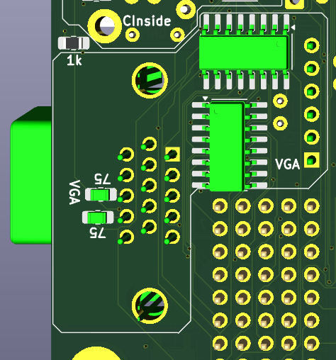
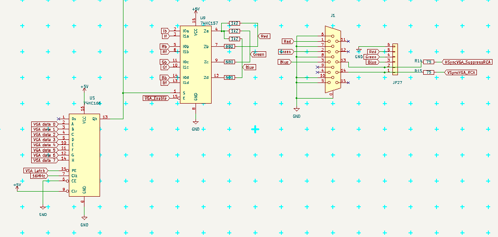
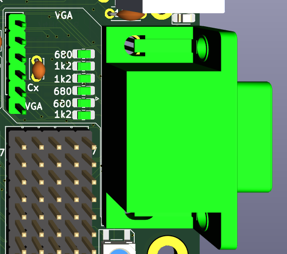

.. vim: ft=rst showbreak=--»\  noexpandtab fileencoding=utf-8 nomodified   wrap textwidth=0 foldmethod=marker foldmarker={{{,}}} foldcolumn=4 ruler showcmd lcs=tab\:|- list tabstop=8 noexpandtab nosmarttab softtabstop=0 shiftwidth=0 linebreak  

:date: 2025.12.09 05:00:06
:_modified: 1970.01.01 00:00:00
:tags: HW,MHF-002
:authors: Gilhad
:summary: VGA
:title: VGA
:nice_title: |logo| %title% |logo|

%HEADER%

VGA
--------------------------------------------------------------------------------

VGA need Vertical Sync (at start of each screen), Horizontal Sync (at start of each line) and Signal (inside the line, it is the pixels).

Vertical Sync is generated by timer on pin PE4 (every 16.64 mS ~ 60 Hz)

Horizontal Sync is generated by timer on pin PB6 (every 32 uS)

VGA signal is generated in interrupt on timer overflow (every 32 uS = each 512  clock ticks)

It needs pin PE7, where 16MHz (system clock) can be configured. As Arduino Mega does not have this pin connected, this was the main reason for making this PCB.

Here are some osciloscope snaps, the magenta line is VSync, yellow line is HSync and green is Signal (sorry for wrong naming in picture)

|SDS00001.png|

(4 screens at 60Hz)

|SDS00007.png|

(1 line with pixels, 32uS)

The main idea came from Squeezing Water from Stone 3: Arduino Nano + 1(!) Logic IC = Computer with VGA and PS/2 from slu4coder - short macro in assembler take character from videoram, take its definition from Flash, puts it as byte to port (PF here) and let 74HC166 to clock it out as 8 pixels. The macro take 8 clock ticks and is repeated 40x to output full line.
Each line is shown 2x so the visible area is 320x400 pixels, but is managed as 320x200 points (25 text lines) for readability and data size (character set takes 256 chars x 8 lines per character = 2kB of Flash.)

The numbers are: 32uS x 16MHz = 512 ticks. 40 characters x 8 ticks = 320 ticks, 512 - 320 = 192 ticks for everything else. When interrupt happens and interrupts are allowed (SEI) the MCU will finish instruction first, then serve the interrupt. This waiting for instruction end may take 1-3 ticks itself, so the interrupt may happen not really regularry and is necesery to adjust for that (macro check in my code). Also it needs to save registers, compute all adresses and offsets and manage possible PS/2 during the line. That may take approx 150 ticks together, leaving like 42 ticks between lines for user code to run in (means 8% speed only).

Then there are the black borders above and below the displayed image (only lines 60 .. 460 are visible), where the user program is mainly executed (which give like 20% of MCU power). It is not much, but a lot of work can be done anyway.

I set not only the Vertical Sync, but also the Horizontal sync to timers, so it does not depend on code exuting, which solved problem where VGA monitor sometimes went blank for few seconds (because some other interrupt or CLI..SEI section moved HSync pulse out of place and monitor get "confused and blank"). Now long uniterruptable section just make small glitch on screen, where pixels are horizontally moved for a frame (1/60 sec).

I also added 74HC157 IC to select foreground/background colors according to 74HC166 output, so now it is possible set foreground/background color for each line separately (I set it for all 16 lines of character the same now). The colors are set on port PH now at the start of visible line.

I also added VGA_ENABLE signal to cut off all pixels output in blank areas, so the ports (PF and PH) can be used for something else (I use PF for PS/2 input, leaving PH for user programs).

I also plan to make hooks on end of each visual line for "mini interrupts" and on end of last visible line (for "run at frame pause" synchronisation of larger blocks, like SD card) to run in interrupt context.

On user level the change of variable frames can be used for synchronisation of larger blocks or for timing events.

Here is schema and placement of the chips on PCB:

|VGA_schema.png|

|VGA_top.png|

|VGA_bottom.png|

Also note, that PB7 (VGA_Latch) is SYSTEM_LED on Arduino, so I placed LED between RCA and PS/2 connector near HALT LED and conected it here. When using VGA the LED will shine with approx 1/8 intensity.

.. |SDS00001.png| image:: SDS00001.png
	:width: 250
	:align: top
	:target: SDS00001.png

.. |SDS00007.png| image:: SDS00007.png
	:width: 250
	:align: top
	:target: SDS00007.png

