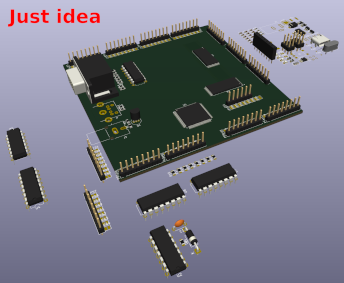
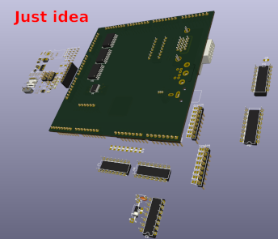
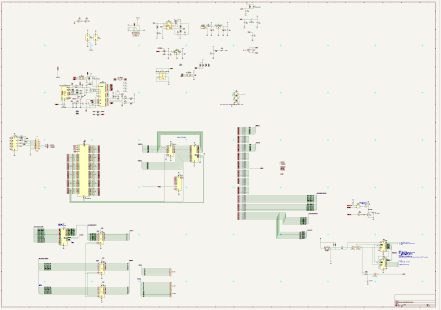

See `Progress <Progress.rst>`__ and `Journal <Journal.rst>`__ ( `top <../README.rst>`__ )

I have some ideas, but it would need lot of work to bring it into life

Two sided PCB with VGA, RCA and PS/2 connectors on front edge, system connector on back edge and I/O connectors along sides

I need two sides to fit everything I want to have

The schema is evolving just now

Some temporary notes:
=====================

* The CPU needs 4 cycles to prepare itself for servicing the interrupt (save the program counter, load the interrupt vector and clear the I bit in SREG). The interrupt vector itself is a jmp instruction that takes 2 cycles. When the ISR is done, it executes the reti instruction (return from interrupt) that takes 4 cycles. 

