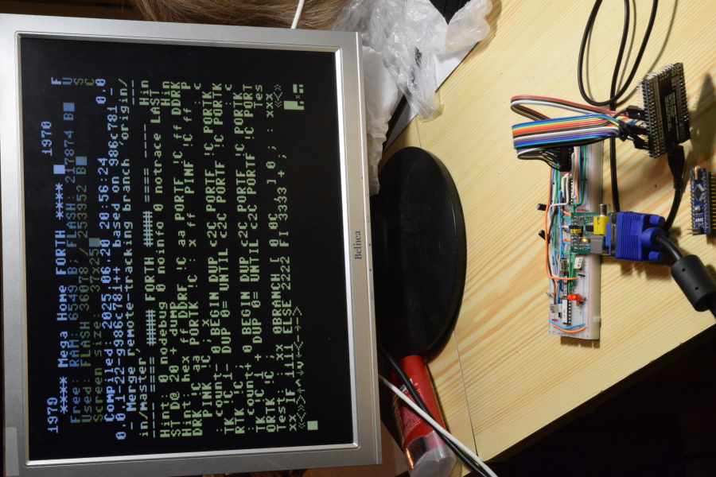

VGA theory and pratice
======================

* Timer 1 generates HSYNC via fast PWM, prescaler x1, period 512 ticks - 32 µs per line, should be OK for VGA (cca `31.25 kHz`).
* Timer 1 generates TIMER1_OVF interrupt for VGA.S to draw lines
* Timer 3 generates VSYNC via fast PWM, prescaler x256, period 260 ticks - 16.64ms per screen, 2 line long sync (64 µs)
* Timer 3 generates TIMER3_OVF interrupt for setting vline=0 and frames++

* HSYNC: low 3.8 µs, high ~28.2 µs - total period `~32 µs` (close to VGA standard for 640×480 @60Hz).
* VSYNC: low 64 µs, high 16.4 ms - total period `~16.464 ms` (`~60.8 Hz`), so timing is fine.
* What standard VGA expects:
* Vertical front porch (~10 lines), then VSYNC low for 2 or 3 full HSYNC periods, then vertical back porch (~33 lines), then visible lines.
* It’s normal for VSYNC to go low during HSYNCs and return high aligned to the HSYNC period
* We have VSYNC (set vline to 0), HSYNC (increase vline. If vline/2 - 30 < 200 draw line (every line is drawn twice). Back porch is around 60 lines (not sure exactly as managed from different interrupts), front porch should be around 60 lines (520-460), so it should fit.
* We use 320x200, but each line is doubled, so effectively we send 320x400 pixels signal.
* Problems:
	* interrupt waits for current instruction finish (and it may be 1-3 clocks), so it starts little randomly
		* read prescaler x1 timer count, AND with 3 and use branches to synchronise (VGA.S part with n1-n3 labels - branch not taken is 1 clock, taken is 2 clocks so we can compensate for 0-3 clocks)
		* but it depends on all instructions before, so there is few `nop` in front so the allignment is moved to right phase (bad phase makes some lines misalligned by half of character )
	* sync pulses are generated in HW independently, but pixels cannot go immediately out, so few `nop` are also after this part to move pixel output safely after end of Hsync (starting soon make unstable picture)
	* too long interrupt also make picture unstable, so the number of ouput characters may be 40, or less, if there is also other work to do. (comment out few `ONECHAR` to see, if it is the problem)

* This is my test setting - breadboard from `NanoHomeFORTH <https://github.com/githubgilhad/NanoHomeComputer>`__ and Arduino Mega Pro temporally used as ATmega2560 breakout with some wires everywhere 
	|DSC_8303.s.jpg|
* Pink VSYNC with 16.4 ms period |SDS00001.png|
* Width of Vsync pulse is 64 µs |SDS00002.png|
* Yellow HSYNC have 3.8 µs pulse |SDS00003.png|
* and Hsync period is 32 µs |SDS00004.png|
* Green pixels are 60 lines from VSYNC pulse |SDS00005.png|
* Some lines have lot of data, some not so much |SDS00006.png|
* 40 characters, 8 pixels each (and 8 clocks each) take 20 µs |SDS00007.png|
* start about 2.8 µs after end of HSYNC |SDS00008.png|
* finish about 3 µs before start of HSYNC |SDS00009.png|

